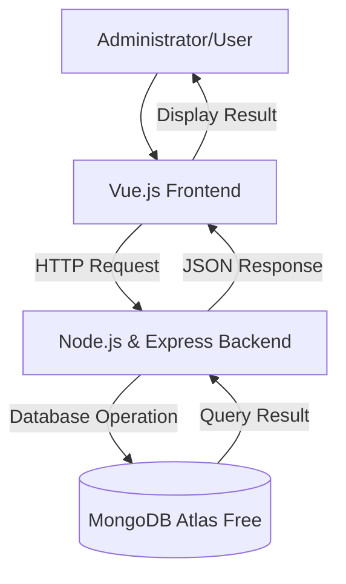
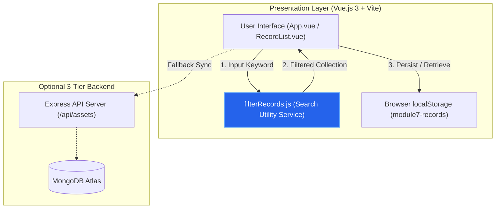

# System Architectural Design
## 1. System Overview
The proposed system is an IT Asset Management System designed to help organizations efficiently manage and monitor their IT assets. It allows administrators to record, assign, update, and track hardware and software assets while maintaining accurate inventory records and asset status.
## 2. Selected Architectural Pattern
The proposed system will use a three-tier client-server architecture.

The system will be divided into:

1. Presentation Layer
2. Application Layer
3. Data Layer

This architecture separates the user interface, business logic, and data management responsibilities, making the system easier to maintain, secure, and expand.
## 3. Architectural Components
### Presentation Layer
The presentation layer will use Vue.js. It will provide a user-friendly interface where administrators can manage assets, assign them to employees, and view inventory information.
### Application Layer
The application layer will use Node.js and Express. It will process client requests, validate user input, implement business rules, and communicate with the database.
### Data Layer
The data layer will use MongoDB Atlas Free. It will store information about IT assets, users, asset assignments, and maintenance records.
## 4. Component Responsibilities
| Component | Technology | Responsibility |
|---|---|---|
| User interface | Vue.js | Displays asset information and collects user input |
| Application server | Node.js and Express | Processes requests, validates data, and applies business rules |
| Database | MongoDB Atlas Free | Stores asset records, assignments, and maintenance history |
| Repository | GitHub | Stores project documentation and tracks version history |
## 5. System Architecture Diagram

## 6. Data Flow
### Example Process: Create a New Record
1. The administrator enters the asset information through the Vue.js interface.
2. Vue.js validates the required input fields.
3. The frontend sends an HTTP request to the Express backend.
4. The backend validates the submitted data and applies business rules.
5. The backend stores the asset information in MongoDB.
6. MongoDB saves the asset record.
7. MongoDB returns the operation result to the backend.
8. The backend sends a JSON response to the frontend.
9. The frontend displays a confirmation message and updates the asset list.
## 7. Database Plan
### Proposed Database Name
```text
it_asset_management_db
```
### Primary Collection
```text
assets
```
Replace records with the main record of the proposed system.
Examples include books, products, tasks, appointments, events, and assets.
### Proposed Fields
| Field | Type | Description |
|---|---|---|
| _id | ObjectId | Unique asset identifier |
| assetName | String | Name of the IT asset |
| assetType | String | Type of asset (Laptop, Desktop, Printer, etc.) |
| serialNumber | String | Manufacturer serial number |
| assignedTo | String | Employee assigned to the asset |
| status | String | Current asset status (Available, Assigned, Under Maintenance, Retired) |
| purchaseDate | Date | Date the asset was purchased |
| createdAt | Date | Date the record was created |
| updatedAt | Date | Date the record was last updated |
## 8. Design Justification
The three-tier architecture is appropriate for the IT Asset Management System because it separates the frontend, backend, and database into independent layers with specific responsibilities. This separation improves maintainability by allowing changes to one layer without significantly affecting the others, enhances security by preventing direct database access from the client, simplifies testing of individual components, and supports future development as new features can be added with minimal impact on the overall system.
## 9. Architectural Limitations
The current activity focuses only on the proposed system architecture. The frontend interface, backend implementation, database integration, user authentication, and deployment have not yet been developed. These components will be implemented during Module 7.

---

## 10. Updated Architecture — Module 9 Evolution (CR-M9-01)

### Evolution Overview
In accordance with Lehman's Laws of Software Evolution (Continuing Change & Conservation of Familiarity), the system architecture was refined to support **CR-M9-01** (Corrective Maintenance for Asset Search Filtering). 

Instead of altering the client-server boundaries, the presentation layer was modularized:
1. Search filtering logic was extracted from inline component state into a centralized pure utility service (`src/utils/filterRecords.js`).
2. The UI components (`App.vue` and `RecordList.vue`) consume the centralized utility, ensuring high cohesion, testability, and zero regression in storage boundaries.



### Architectural Impact Summary
- **Affected Elements:** Presentation layer utility boundary (`filterRecords.js`) and component integration (`App.vue`).
- **Unchanged Elements:** System storage layer (`localStorage` key structure), component hierarchy (`RecordList`, `RecordForm`), and optional 3-tier Node/Express architecture.
